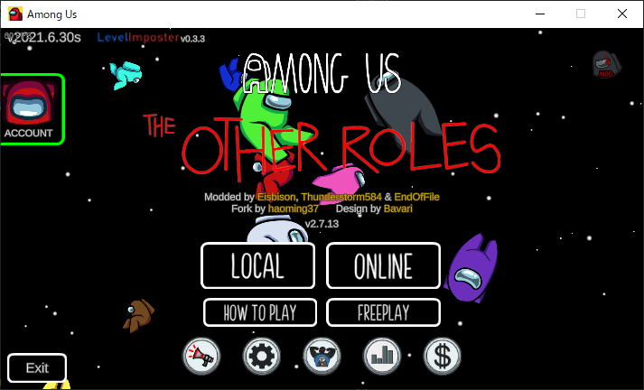

# TheOtherRoles

<!-- TOC -->

- [TheOtherRoles](#theotherroles)
  - [概要](#概要)
  - [導入方法](#導入方法)
    - [0. 必要なファイルをダウンロードする](#0-必要なファイルをダウンロードする)
    - [1. インストールフォルダを開く](#1-インストールフォルダを開く)
    - [2. MODの削除（古いバージョンを入れている場合)](#2-modの削除古いバージョンを入れている場合)
    - [3. MODのインストール](#3-modのインストール)
    - [4. 起動確認](#4-起動確認)
  - [マップへの変更点](#マップへの変更点)
    - [Polusの変更点](#polusの変更点)
    - [AirShipの変更点](#airshipの変更点)
  - [カスタムロール](#カスタムロール)
    - [インポスター陣営](#インポスター陣営)
      - [Mafia](#mafia)
      - [Morphing](#morphing)
      - [Camouflager](#camouflager)
      - [Vampire](#vampire)
      - [Eraser](#eraser)
      - [Trickster](#trickster)
      - [Cleaner](#cleaner)
      - [Warlock](#warlock)
      - [Misimo](#misimo)
      - [Ballad](#ballad)
      - [Predator](#predator)
      - [Trapper](#trapper)
      - [Bomber](#bomber)
      - [Mifune](#mifune)
      - [Madmate](#madmate)
    - [クルーメイト陣営](#クルーメイト陣営)
      - [Sheriff](#sheriff)
      - [Seer](#seer)
      - [Engineer](#engineer)
      - [Detective](#detective)
      - [Lighter](#lighter)
      - [Medic](#medic)
      - [Mayor](#mayor)
      - [Hacker](#hacker)
      - [Shifter](#shifter)
      - [Time Masters](#time-masters)
      - [Swapper](#swapper)
      - [Tracker](#tracker)
      - [Snitch](#snitch)
      - [Spy](#spy)
      - [Security Guard](#security-guard)
    - [第3陣営](#第3陣営)
      - [Guesser](#guesser)
      - [Child](#child)
      - [Jester](#jester)
      - [Lovers](#lovers)
      - [Jackal](#jackal)
      - [Sidekick](#sidekick)
      - [Arsonist(放火魔)](#arsonist放火魔)

<!-- /TOC -->

## 概要
できること
- カスタムロールの追加
- Polusでのランダムリスポン
- Polus、AirShipでの追加ベント

## 導入方法
### 0. 必要なファイルをダウンロードする

[TheOtherRoles+HaomingMod.2.7.31.zip](https://github.com/haoming37/Doc_TheOtherRoles/releases/download/2.7.31/TheOtherRoles+HaomingMod.2.7.31.zip)  
### 1. インストールフォルダを開く
Steamのライブラリ　-> AmongUsを右クリック　→ プロパティ → ローカルファイル　→ ローカルファイルを閲覧


### 2. MODの削除（古いバージョンを入れている場合)
赤枠で囲われているファイルを削除する  
  

### 3. MODのインストール
0.でダウンロードしたzipファイルを解凍して中身を展開する  


### 4. 起動確認
4-1. TheOtherRolesの表記があればOK  
  
4-2. 接続先はHaomingAWSを選択する  
  

## マップへの変更点
オプションで追加ベントとPolusでのランダムリスポンを有効化することができる

### Polusの変更点
  
### AirShipの変更点
  

## カスタムロール
インポスター、クルーメイト、Lovers、Jester、Jackal陣営のロールを追加することができる

### インポスター陣営

---
#### Mafia
- 3人組のインポスター(インポスター3以上に設定する必要あり)  
- Godfather→通常のインポスター  
- Mafioso→Godfatherが死ぬと次のインポスターになる、Godfather死ぬまではキルもサボタージュもできない  
- Janitor→キルもサボタージュもできない  死体を隠せる　死体が隠されるとVITALで見ると白くなる

---
#### Morphing
- 近くのプレイヤーをスキャンすることができる
- 再度使用すると１０秒間スキャンしたプレイヤーの見た目に変身することができる

---

#### Camouflager
- カモフラージュボタンを押すと全員の見た目が１０秒間同じになる

---
#### Vampire
- キルが噛みつきに変わる  
- 噛まれた対象は一定時間後に死亡する(デフォルトで10秒)  
※キルクールダウンは死亡後に開始する  
※この時間内にミーティングが開始された場合はミーティング開始時に死亡する  

- Vampireがいる場合は全ユーザにニンニクがくばられる  
- ニンニクを使用すると設置することができ、その範囲内では噛みつきが通常のキルに変化する(設定でキルそのものができないようにもできる)

---
#### Eraser 
- ターゲットにされたプレイヤーは次の会議以降から特殊能力が使えなくなる  
- 一度使用する毎にクールダウンが10秒ずつ増加していく

---
#### Trickster
- 他のプレイヤーから見えないボックスを3つ置くことができる  
- ボックスは、3つ目が置かれた後の次の会議の後から、他のプレイヤーから視認可能になり、Tricksterのみが使用可能なベントになる  
- ボックスの設置が終わると、新たな能力として一定時間プレイヤーの視界範囲を狭くすることができる(時間経過で終わる停電状態)

---
#### Cleaner
- 死体を消すことができる

---
#### Warlock
- クルーメイトに呪いをかけることができる  
- 呪いをかけられたクルーメイトが他プレイヤーのそばにいるとき、Warlockは、呪いをかけられたクルーメイトで他プレイヤーをキルできる  
- 呪いによってキルを行うと、呪いは解け、Warlockはしばらく動けなくなる  
- 呪いによるキルと通常のキルのクールタイムは共通  

※呪いによるキルは、インポスターもキルできる（自分もキルできる）  
※通常のキルでは呪いは解除されない  
※WarlockはVampireとは同じゲームに存在できない  

---
#### Misimo
- 独自のキルクール設定項目を持つ
- 一度キルを行うとタイマーが動作開始する(1-60s)
- タイマーが0になると自殺する
- タイマーはキルを行う、会議が始まるとリセットされる
- 透明化ボタンを押すと透明になることができる
- 透明化ボタンのクールダウンが無いため常時透明化可能（効果が切れる一瞬のみ姿が見えるので注意）
- 透明化能力はオプションで無効化可能

---
#### Ballad
クルーメイトの投票を無効化することができる  
基本仕様
- タスクフェイズ中にsealボタンを使って指定したクルーメイトの投票を無効票にできる
- 投票無効化は対象指定後、一定時間で効果が切れる
- タスクフェイズ毎に一度のみ使用可能
- インポスターにも使用できる

オプション
- 投票無効化効果の永続化（一度指定した対象を変更することができない）
- 無効化された投票の投票画面での表示/非表示設定
- 投票無効化の有効時間、投票無効化のクールダウン  

---
#### Predator
透明になって移動速度を上げることができる
- 透明化効果時間(緑字）と透明化クールダウン（白字）がある
- 透明化キャンセルボタンで透明化をキャンセルすることができる（再発動までには元々の効果時間＋クールダウン秒数を待つ必要がある）
- 透明化中は見た目が黒くなり移動速度が設定値分上昇する  

---
#### Trapper
トラップを設置することができる
- トラップを踏むとプレイヤーが死ぬ/一定時間行動不能になる
- 死ぬ/一定時間行動不能になるはオプションで切り替え
- 行動不能時間はオプションで設定可能
  
---
#### Bomber
爆弾を設置してクルーメイトをキルすることができる
- 爆弾設置時間はオプション
- 会議を跨いで爆弾が残るかはオプション
- 複数対象に爆弾を設置できるかはオプション
- 爆破時に付近のプレイヤー（インポスター含む）を殺害するかはオプション
  
---
#### Mifune
千里眼で本来の視界以上の範囲を見ることができる
- 千里眼中はマウスのクリック判定がおかしくなるためキーボードでの操作のみ可能
-  千里眼発動後、一定時間で元に戻る
-  ボタン等の表示がおかしくなった場合はTabキーを押すと直る
  
---
#### Madmate
- インポスター陣営側のクルーメイト
- タスクなし（フェイクタスク）
- キルもサボタージュもできない
- 誰がインポスターか分からない
- インポスターからも誰がMadmateか分からない
- インポスター陣営が勝利すると勝利となる

### クルーメイト陣営

---
#### Sheriff
- インポスターを殺すことができる
- 間違えてクルーメイトを殺そうとした場合は自身が死ぬ（殺そうとした対象は死なない)  
※ 殺すことができる対象はオプションで変更可能(第3陣営、Madmate、SPY)


---
#### Seer
幽霊とキルフラッシュを見ることができる
- 死んだタイミングで画面が点滅する(数秒程度のラグあり)  
※時々バグで動作しないことがある
- 死体があった場所にSeerのみが見ることができる幽霊が表示される

---
#### Engineer
- 各サボタージュを一度だけどこからでも治せる  
- ベントが使える  
- エンジニアがベント内にいるとインポスターはベントに青い枠を視認することができる（全てのベントの枠がでる）

---
#### Detective
- 他のプレイヤーの足跡を見ることができる  
- レポートをすると犯人のヒントがゲーム内メッセージでもらえる   
e.g 犯人は暗い色(or 明るい色)だった  
明るい色: pink orange yellow white cyan lime  
暗い色: red blue green grey purple brown  

---
#### Lighter
- クルーメイトよりも視野が広くなる（設定で変更可能）
- 一定時間（デフォルトで5秒）視野を広くすることができる
- スキル発動中はCamo、Morphling、透明化を看破することができる
- スキルが発動していない場合は透明化していない対象をCamo状態で視認することができる

---
#### Medic
- 選択したプレイヤー一人にシールドを張ってキルできなくすることができる。  
- メディックが死んだらシールドは消える  
- Sheriffがシールドが付いたプレイヤーをキルしようとするとシールドが移動する？  
- シールドがついたSheriffがプレイヤーをキルしようとするとシールドが移動する？  
- レポートすると死んだ時刻が分かる  

---
#### Mayor
- 一人で2票分の投票になる  
- ミーティング回数の上限に達していてもミーティングボタンを押すことができる

---
#### Hacker
- スキルを有効化すると有効時間内のみ下記の効果が発動する  
1. Adminがプレイヤーの色付きになる  
2. Vitalで死亡からの経過時間を見ることができる  

- MorphlingやCamouflagerのスキルによりプレーヤーの色が変化している場合、各色は以下のように表示される  
pink orange yellow white cyan lime　→　明るい色  
red blue green grey purple brown　→　暗い色  

---
#### Shifter
- 選択した他のプレイヤーのロールが奪える  
※第3陣営との入れ替わりが可能  
- 次の会議が終わると変更が有効になる  
- 奪われたプレイヤーは普通のクルーメイトになる
- インポスター陣営を奪おうとすると自殺する  

※Shifterのロール奪取は、Eraserのロール消去より先に実行される  
ゲーム中一度のみ使用できる特殊行動（Engineerのどこでもサボタージュ修理など）は、
奪われたプレーヤーがまだその特殊行動を行っていなかった場合のみ使用できる

---
#### Time Masters
- 一定時間有効なバリアを貼ることができる(デフォルト3秒)
- バリア中にキルが実行されると時間がオプションで設定した秒数巻き戻る（全プレイヤーの位置が強制移動させられる）

キルはクールダウン状態にならないため、結局逃げないといけない
時間の巻き戻りは位置のみ反映される（インポスターのキルクールダウンやクルーメイトのタスク進行状況などは巻き戻らない）  
バリアはVampireの噛みつき（一定時間後に死ぬ攻撃）にも有効  
Medicのシールドが有効な場合、時間は巻き戻らない  

---
#### Swapper
- 選択した二人の投票結果の入れ替えができる

---
#### Tracker
- 選択したプレイヤーのいる方向が矢印で表示されるようになる
- 矢印は一定時間ごとに更新される

---
#### Snitch
- タスクが全て終わるとインポスターのいる方向に矢印が出るようになる  
- タスクが残り一つになるとインポスター側にSnitchがいる方向に矢印がでるようになる(オプション ON/OFF)

---
#### Spy
クルーメイト陣営だがインポスターからはインポスターと同じ見た目になる
- インポスターからインポスターと同様に見える  
- 設定でキル判定について変えることができる
- インポスターがスパイを殺せない
- インポスターがスパイを殺せるが相方のインポスターも殺せる
- Sheriffがスパイを殺せる(オプション ON/OFF)

---
#### Security Guard
- 「カメラになる」「ベントをふさぐ」スクリューを置くことができる  
スクリューは置いた次の会議以降に有効になる  
- 「カメラになる」スクリューによって追加されたカメラは、誰からも使える（カメラ自体も全員見える）  
- 「ベントになる」スクリューによって封印されたベントは、出入りできない（他のベントから地下に移動することは可能）  
  
Tricksterのボックスは封印できない  
Skeldでカメラを追加した場合、3秒ごとに表示が切り替わる  

### 第3陣営

---
#### Guesser
インポスター陣営側とクルー側のどちらかの陣営に割り当てられる
会議時に任意のプレイヤーを選択してそのプレイヤーの役職を予想する
予想が当たると選択したプレイヤーが死亡する
外した場合は自身が死亡する
- オプションでどちらの陣営になるかの確率調整が可能
- 投票画面でプレイヤーのアイコンをクリックすると役職予想画面に遷移する

---
#### Child
- 子供から始まって徐々に成長していく
開始時に67%でクルーメイト、33%でインポスターが割当られる

- クルーメイトの場合: 成長が終わる前に追放するとクルーメイト陣営の敗北となる  
- インポスターの場合: 成長中→キルクールダウン2倍　成長後→キルクールダウン2/3倍  

※インポスターは成長するまでChildをキルすることができない

---
#### Jester
てるてる  
- 吊られたら勝ち

---
#### Lovers
二人組のペア、片方が死んだら両方死ぬ  
- 両方が生き残った状態でゲームが終了すると勝利になる
- 相方は名前の色で確認可能だがロールまでは分からない  
- インポスターを含めることもできる  

組み合わせ例
```
クルーメイト - クルーメイト  
インポスター - クルーメイト  
```
インポスターとクルーメイトの組み合わせの場合は生存者が下記の組み合わせの場合のみLovers陣営の勝利となる
パターン1　※インポスターも敗北
- Lovers(クルーメイト)
- Lovers(インポスター)

パターン2 ※インポスターも敗北
- Lovers(クルーメイト)
- Lovers(インポスター)
- インポスター

下記のパターンの場合はゲームが終了せずに継続となる  
※lovers(クルーメイト)をキルできればインポスターの勝ち
※クルーメイトをキルできればloversの勝ち
パターン3
- クルーメイト
- Lovers(クルーメイト)
- Lovers(インポスター)
- インポスター

---
#### Jackal
Jackal陣営  
他の陣営のプレイヤーがいなくなると勝利
- タスクなし
- 他の全ての陣営をキルすることができる
- 他のプレイヤーを一人選んでSidekickにすることができる(オプション ON/OFF)
- Jackalが死んだ場合にSidekickがJackalに昇格する(オプション ON/OFF)
- 昇格後に新たなSideKickを選定することができる(オプション ON/OFF)
- ベントが使える(オプション ON/OFF)  
※Jackalは一度しかSidekickを選ぶことができない(Sidekickが死んだ場合は新たなSidekickは生まれない)

#### Sidekick
Jackalに選ばれると元々のロールを失ってSideKickになる  
※選ばれた瞬間に自身とJackalの名前が水色で見えるようになる
- キルができる(オプション ON/OFF)
- ベントが使える(オプション ON/OFF)

---
#### Arsonist(放火魔)  
一人勢力  
- タスクなし
Arsonist(放火魔)
- 一人勢力
- タスクなし
- DOUSEボタンを押すと一定時間後(1~10秒で設定）に隣のプレイヤーに液体をかけることができる
- 液体をかけたプレイヤーは画面左下にアイコンで表示される、会議後も判定はリセットされない
- 全ての生存しているプレイヤーに液体をかけると発火ボタンを押すことができ、発火ボタンを押すとArsonistの勝利となる
