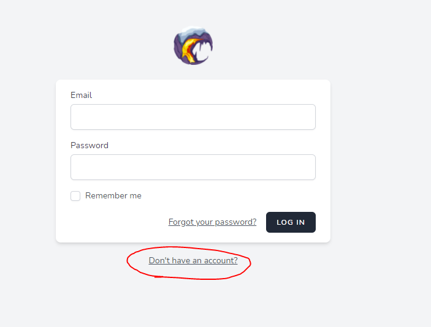

<!-- TOC -->

- [1. Polus.gg導入手順](#1-polusgg導入手順)
	- [1.1. 対象者](#11-対象者)
	- [1.2. 事前準備](#12-事前準備)
		- [1.2.1. TheOtherRolesのMod環境のバックアップを作成](#121-theotherrolesのmod環境のバックアップを作成)
		- [1.2.2. Polus.ggのアカウント作成](#122-polusggのアカウント作成)
	- [1.3. Modの導入](#13-modの導入)
		- [1.3.1. Steamへの追加](#131-steamへの追加)
		- [1.3.2. 起動](#132-起動)
	- [1.4. TheOtherRoles環境と両方で遊べるようにする](#14-theotherroles環境と両方で遊べるようにする)
		- [1.4.1. バックアップを元に戻す](#141-バックアップを元に戻す)
		- [起動方法](#起動方法)

<!-- /TOC -->
# 1. Polus.gg導入手順
## 1.1. 対象者
Uryuryu鯖TheOtherRolesModを使って遊んでいる人達
## 1.2. 事前準備
### 1.2.1. TheOtherRolesのMod環境のバックアップを作成
  
  
ひとつ上の階層に移動
  
Among Usをコピーする
  
コピーじゃない方のAmong Usに戻ってMODを削除する

### 1.2.2. Polus.ggのアカウント作成
https://account.polus.gg/login  
※ここのDisplay Nameに登録した名前がゲーム内での表示名になるので注意

## 1.3. Modの導入
### 1.3.1. Steamへの追加
SteamのストアでPolug.ggと検索して出てきたアプリを追加する
### 1.3.2. 起動
Steamの通常のゲームと同じ方法で起動できるようになる
  
Playボタンを押すと立ち上がる  
AutoDetectを押してからLaunchボタンを押すとAmong Usが起動する
  
左上にPolus.ggの表記があれば成功
  
ONLINEをクリック後にLOGINボタンを押して事前準備で作成したアカウントでログインする
  

## 1.4. TheOtherRoles環境と両方で遊べるようにする
### 1.4.1. バックアップを元に戻す
  
  
ひとつ上の階層に移動
  
Among Usを削除してAmong Us - コピーをAmong Usにリネームする
  

### 起動方法
Among Usを起動すると今までのもの、Polus.ggを起動すると新マップのものを切り替えて遊べるようになる
  